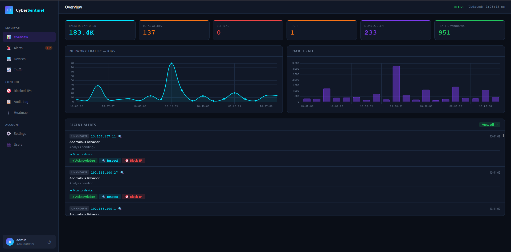

# Shield CyberSentinel
### AI-Powered Behavioral Network Threat Detector with LLM Explainability

MIT License - free to use, modify, and distribute with attribution.

Built by Sanadeed Khan as a cybersecurity portfolio project.
